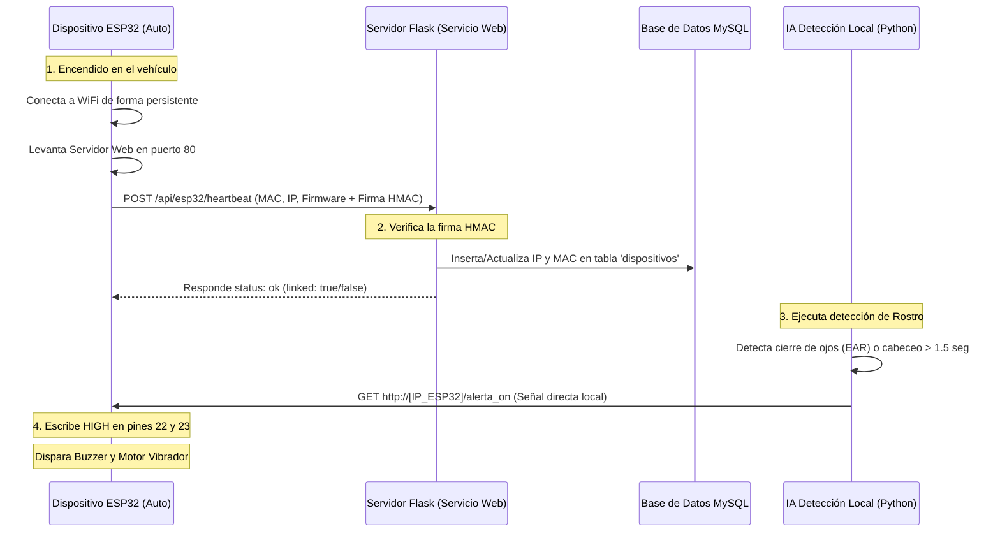
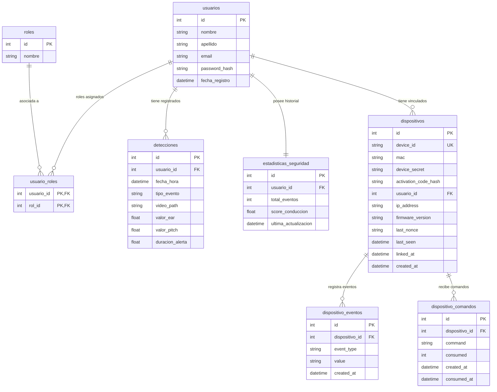

# GUÍA DE ESTUDIO EXHAUSTIVA: DEFENSA DE TESINA (HITO 2)
**Proyecto:** VISION — Sistema de Seguridad Vial Inteligente y Detección de Somnolencia
**Integrantes:** Dylan Kiyama, Menzio Juan Cruz  
**Evaluadora:** Prof. Yanil Berthalet  
**Institución:** Instituto Técnico Río Tercero  

---

## 1. GUÍA RÁPIDA "EXPLICADO PARA PRINCIPIANTES"

### ¿Qué hace nuestro sistema en palabras simples?
Imagina que vas conduciendo un camión o auto a altas horas de la noche. El cansancio te vence y, sin darte cuenta, cierras los ojos por un segundo o tu cabeza se inclina bruscamente (el famoso "cabeceo"). Nuestro sistema **VISION** es un copiloto virtual inteligente que te vigila permanentemente. 

Consta de tres partes que trabajan en equipo:
1. **La Cámara y la IA (Frontend e Inteligencia Local):** Una cámara enfoca tu rostro. Un programa especial en la computadora del auto analiza tu cara en tiempo real y calcula si tus ojos están cerrados o si tu cabeza cayó.
2. **La Alarma Física (Módulo IoT - ESP32):** Si la IA confirma que te estás durmiendo, le envía inmediatamente una señal por red inalámbrica a un pequeño dispositivo receptor (un circuito llamado ESP32) colocado en el tablero. Este dispositivo enciende un zumbador muy ruidoso (buzzer) y hace vibrar el volante o el asiento para despertarte al instante.
3. **El Servidor y la Base de Datos (Backend y Reportes):** Al mismo tiempo, el sistema junta los 10 segundos previos de video (como la caja negra de los aviones) y sube este clip junto con el registro del evento a una página web privada. Así, tú o la empresa de transporte pueden revisar el historial de alertas y evaluar tu fatiga en el mapa de viaje.

---

### Glosario Ultra Simple de Términos de Programación

*   **Frontend (Frente de la Aplicación):** Es la parte visual del sistema, lo que el usuario ve y toca en la pantalla (las páginas de login, registro, el dashboard con los gráficos y la página de compra).
*   **Backend (Cerebro del Servidor):** Es el código que corre "detrás de escena" en la cocina del servidor web. Se encarga de validar quién eres, guardar los datos en la base de datos, enviar correos de recuperación y dar órdenes a los dispositivos. En nuestro proyecto está hecho con **Flask** (un framework de Python).
*   **Base de Datos (Archivador):** Es una gran biblioteca digital estructurada en tablas donde guardamos de forma permanente los usuarios, sus contraseñas encriptadas, el historial de alertas y los dispositivos asociados.
*   **Hash (Picadora de contraseñas):** Es un proceso de seguridad que transforma una contraseña legible (ej: `Mamá123!`) en una ensalada de caracteres indescifrable (ej: `$2b$12$L87h...`). Es un viaje de ida sola: el servidor nunca guarda tu contraseña real, solo el hash. Si alguien roba la base de datos, solo verá la ensalada de letras y no podrá saber cuál es tu clave. En el proyecto usamos **Bcrypt** para esto.
*   **Sesión (Pulsera de entrada):** Cuando inicias sesión, el servidor te da una "pulsera digital temporal" (Cookie de sesión). Cada vez que cambias de página, tu navegador le muestra esa pulsera al servidor para que este sepa quién eres sin pedirte usuario y contraseña a cada segundo.
*   **Token (Llave temporal firmada):** Un código secreto con fecha de vencimiento que sirve para autorizar una acción específica. Por ejemplo, al recuperar la contraseña, te enviamos un mail con un token válido por 1 hora; si no lo usas a tiempo, la llave "se destruye" automáticamente.
*   **API (Application Programming Interface - El Mozo):** Es un puente de comunicación estándar entre programas independientes. Por ejemplo, el programa de visión artificial le "pide al mozo" (API) que guarde una detección en la base de datos de Flask mediante un mensaje estructurado en formato JSON.
*   **MediaPipe Face Mesh (Malla Facial):** Es una tecnología de inteligencia artificial creada por Google que detecta instantáneamente tu cara y coloca en ella **468 puntos invisibles** (llamados *landmarks*). Esto permite medir con precisión milimétrica la separación de los párpados y la posición exacta de las cejas y la nariz.
*   **EAR (Eye Aspect Ratio - Apertura Ocular):** Es una fórmula matemática simple. Mide la distancia vertical entre los párpados dividida por la distancia horizontal del ojo. Si el ojo está abierto, el EAR da un valor alto (ej: `0.32`). Si se cierra, el EAR cae casi a cero (ej: `0.15`).
*   **Pitch (Cabeceo):** Es el ángulo de inclinación vertical de la cabeza. Si miras hacia abajo (te duermes), el pitch cambia bruscamente.
*   **Lazo Cerrado (Closed Loop):** Es un principio de control. Significa que la alarma física en el auto no se apagará simplemente porque pasó el tiempo; seguirá sonando y vibrando de forma persistente hasta que el sistema de IA verifique visualmente que volviste a abrir los ojos y enderezar la cabeza.

---

## 2. ANÁLISIS PASO A PASO DE LOS REQUISITOS DEL HITO 2

En esta sección te mostramos exactamente en qué archivos y líneas de código del proyecto está implementada cada función, para que puedas decírselo al tribunal con total seguridad.

### a) Vistas Web Implementadas

#### 1. Vista Principal (Landing Page)
*   **¿Dónde está en el código?** 
    *   Diseño HTML: [app/templates/index.html](file:///c:/Users/juanc/vision/vision/app/templates/index.html)
    *   Ruta del servidor: [app/controllers.py](file:///c:/Users/juanc/vision/vision/app/controllers.py#L170-L172)
*   **¿Cómo funciona?**
    Al escribir la dirección web de tu proyecto, el servidor Flask recibe una petición en la ruta raíz `/` y responde cargando el archivo de plantilla `index.html`. Esta vista muestra el diseño estético de **VISION**, con información del problema de la fatiga vial, las características de la solución, botones para iniciar sesión o registrarse, y una sección atractiva para ir a la compra del dispositivo.

#### 2. Vista de Registro
*   **¿Dónde está en el código?**
    *   Diseño HTML: [app/templates/register.html](file:///c:/Users/juanc/vision/vision/app/templates/register.html)
    *   Lógica y validaciones: [app/controllers.py](file:///c:/Users/juanc/vision/vision/app/controllers.py#L180-L242)
*   **¿Cómo funciona?**
    El formulario pide Nombre, Apellido, Correo Electrónico y Contraseña. Cuenta con dos capas de seguridad:
    1.  **Validación de Formato de Email:** La función `valid_email(email)` en [app/controllers.py:L51](file:///c:/Users/juanc/vision/vision/app/controllers.py#L51) usa una *Expresión Regular* para asegurar que el usuario ingrese un correo válido (que contenga un `@` y un dominio como `.com`).
    2.  **Validación de Contraseña Segura:** La función `valid_password(pw)` en [app/controllers.py:L55-L64](file:///c:/Users/juanc/vision/vision/app/controllers.py#L55-L64) exige de manera estricta que la contraseña tenga:
        *   Mínimo 8 caracteres de largo.
        *   Al menos una letra mayúscula.
        *   Al menos un número.
        *   Al menos un carácter especial (como `!`, `@`, `#`, etc.).
    Si alguna validación falla, se muestra un cartel rojo dinámico (`flash message`) sin borrar lo que el usuario ya había escrito. Si el email ya está registrado o el servidor MySQL se encuentra temporalmente offline, el sistema lo detecta y redirige preventivamente a la plantilla [register_offline.html](file:///c:/Users/juanc/vision/vision/app/templates/register_offline.html) para asegurar que el sistema no falle bruscamente.

#### 3. Vista de Login (Inicio de Sesión y Recuperación)
*   **¿Dónde está en el código?**
    *   Diseño HTML: [app/templates/login.html](file:///c:/Users/juanc/vision/vision/app/templates/login.html)
    *   Procesamiento del Login: [app/controllers.py](file:///c:/Users/juanc/vision/vision/app/controllers.py#L252-L282)
    *   Recuperación de Contraseña: [app/controllers.py](file:///c:/Users/juanc/vision/vision/app/controllers.py#L684-L733) (plantillas [forgot_password.html](file:///c:/Users/juanc/vision/vision/app/templates/forgot_password.html) y [reset_password.html](file:///c:/Users/juanc/vision/vision/app/templates/reset_password.html))
*   **¿Cómo funciona?**
    *   **Autenticación:** El usuario ingresa su correo y contraseña. El backend busca al usuario en la base de datos.
    *   **Chequeo de Contraseña Encriptada:** Como la contraseña en la base de datos está guardada como un hash indescifrable, no podemos compararla directamente con texto plano. Usamos la función `check_password(pw)` en [app/models.py:L69-L70](file:///c:/Users/juanc/vision/vision/app/models.py#L69-L70), la cual toma la contraseña que el usuario escribió en el login, le aplica el algoritmo Bcrypt y compara si el hash resultante coincide con el guardado en la base de datos. Si coincide, la función `login_user` de la librería `Flask-Login` inicia la sesión de manera segura.
    *   **Recuperación:** Si el usuario olvida su clave, ingresa su correo en `/forgot-password`. El sistema utiliza un objeto de seguridad llamado `URLSafeTimedSerializer` para codificar el email del usuario en un Token seguro y temporal. Luego, mediante `Flask-Mail` (configurado en `app/__init__.py`), envía un correo electrónico automático al usuario con un enlace que incluye dicho Token. Al hacer clic, la ruta `/reset-password/<token>` valida que el token no haya sido alterado ni haya vencido (expira en 1 hora), permitiéndole reescribir una nueva contraseña que se hashea antes de guardarse en la base de datos.

#### 4. Vista de Modificación de Usuario (Perfil y Roles)
*   **¿Dónde está en el código?**
    *   Diseño HTML: [app/templates/editar_usuario.html](file:///c:/Users/juanc/vision/vision/app/templates/editar_usuario.html)
    *   Ruta del servidor: [app/controllers.py](file:///c:/Users/juanc/vision/vision/app/controllers.py#L433-L502)
*   **¿Cómo funciona?**
    Esta vista permite a cualquier usuario registrado modificar sus datos personales básicos (Nombre y Apellido). Sin embargo, cuenta con un potente mecanismo de control de acceso:
    *   Si el usuario que ingresa tiene el rol de **"Administrador"** (lo cual se verifica con la función `current_user.has_role('Administrador')` en [app/models.py:L72](file:///c:/Users/juanc/vision/vision/app/models.py#L72)), la interfaz web se expande y le permite editar campos críticos como el correo electrónico del usuario y asignarle nuevos roles (como promover a alguien de "Usuario común" a "Administrador").
    *   Para evitar que un usuario común altere datos de otro, la línea `if not is_admin and user_id != current_user.id: abort(403)` bloquea inmediatamente cualquier intento no autorizado con un error de seguridad HTTP 403 (Prohibido).

#### 5. Vista de Alta de Dispositivo (Vincular ESP32)
*   **¿Dónde está en el código?**
    *   Diseño HTML: [app/templates/dispositivos.html](file:///c:/Users/juanc/vision/vision/app/templates/dispositivos.html)
    *   Ruta del servidor: [app/controllers.py](file:///c:/Users/juanc/vision/vision/app/controllers.py#L330-L376)
*   **¿Cómo funciona?**
    Esta vista permite vincular físicamente tu dispositivo físico de alertas a tu cuenta digital. El usuario ingresa el Identificador de Dispositivo (`device_id`) y el Código de Activación temporal.
    El backend realiza 4 validaciones fundamentales antes de asignarlo en la base de datos:
    1.  Verifica que el dispositivo exista registrado en el sistema.
    2.  Verifica que el dispositivo no esté previamente vinculado a otro usuario.
    3.  Verifica que el dispositivo esté encendido y transmitiendo (campo `last_seen` en la base de datos) dentro de una ventana de tiempo reciente de 10 minutos (`DEVICE_ONLINE_WINDOW_MINUTES = 10`), garantizando que la red funciona.
    4.  Compara mediante hasheo Bcrypt que el código de activación ingresado por el usuario coincida con el hash de activación de fábrica (`dispositivo.activation_code_hash`).
    Si todo es correcto, el servidor actualiza la columna `usuario_id` del dispositivo con el ID del usuario actual, logrando la vinculación física-digital.

#### 6. Vista Visual de Compra (Mock Checkout)
*   **¿Dónde está en el código?**
    *   Diseño HTML: [app/templates/comprar.html](file:///c:/Users/juanc/vision/vision/app/templates/comprar.html)
    *   Ruta del servidor: [app/controllers.py](file:///c:/Users/juanc/vision/vision/app/controllers.py#L175-L177)
*   **¿Cómo funciona?**
    Esta es una vista premium de e-commerce que simula la compra del kit **VISION** (cámara, soporte y módulo ESP32) por un valor de ARS $189.999.
    *   **Diseño Visual:** Utiliza estilos CSS modernos, una grilla técnica de especificaciones del dispositivo, preguntas frecuentes dinámicas con acordeones interactivos y un banner de contacto institucional (`vision@itrt.edu.ar`).
    *   **Simulación de Pago:** El botón principal para pagar por **Mercado Pago** está vinculado a una función JavaScript en las líneas [865-883](file:///c:/Users/juanc/vision/vision/app/templates/comprar.html#L865-L883). Al hacer clic, el botón cambia dinámicamente su estado a "Conectando...", simula una espera de red de 1.2 segundos con un spinner estético y finalmente muestra un cuadro de diálogo informando al usuario que la pasarela de pagos se encuentra en fase de integración para el Hito 3, y le brinda la opción de contactar directamente por mail.

---

### b) Manejo y Seguridad de Sesiones

#### ¿Cómo está implementado el control de sesiones?
En el archivo [app/__init__.py](file:///c:/Users/juanc/vision/vision/app/__init__.py), configuramos el motor de autenticación usando la librería **Flask-Login** (`LoginManager`). 
*   **La Cookie Firmada:** Flask no guarda el estado del usuario en su memoria RAM de forma continua. En su lugar, cuando inicias sesión, Flask escribe una Cookie llamada `session` en el navegador del usuario. Esta cookie contiene el ID del usuario encriptado y firmado digitalmente usando una contraseña maestra del servidor llamada `SECRET_KEY` (configurada en la línea [46](file:///c:/Users/juanc/vision/vision/app/__init__.py#L46)).
*   **Integridad:** Si un atacante intenta alterar la cookie en su computadora para hacerse pasar por otro usuario, la firma digital se rompe automáticamente porque no tiene el `SECRET_KEY`, y el servidor rechaza la cookie al instante por seguridad.
*   **Carga del usuario en cada clic:** En cada interacción del usuario, la función `@login_manager.user_loader` (definida en las líneas [76-81](file:///c:/Users/juanc/vision/vision/app/__init__.py#L76)) se ejecuta automáticamente. Lee el ID de la cookie firmada y hace una consulta rápida a la base de datos MySQL para cargar toda la información del usuario en la variable global `current_user`.

#### Comportamiento en Nueva Pestaña vs. Diferente Navegador
Esta es una pregunta clásica que los profesores adoran hacer para evaluar si entiendes cómo funciona la infraestructura de la web:

1.  **Si abres una NUEVA pestaña en el MISMO navegador (ej: Google Chrome):**
    *   **Explicación:** El sistema operativo maneja las cookies a nivel de aplicación (proceso del navegador). Chrome mantiene activo su almacén de cookies en RAM para todas las pestañas y ventanas que abras dentro de él. Al abrir una nueva pestaña y escribir la dirección de la web de Vision, Chrome adjunta de forma automática la cookie de sesión firmada en la cabecera del request HTTP. El servidor recibe la cookie, verifica la firma, ve que es válida y te permite ingresar al dashboard directamente sin pedir credenciales.
2.  **Si abres la página en OTRO navegador (ej: abrir Firefox teniendo la sesión activa en Chrome):**
    *   **Explicación:** Firefox e Internet Explorer (o Chrome en modo Incógnito) corren en procesos de memoria completamente separados y aislados. No tienen acceso físico al almacén de cookies de Google Chrome (están en "frascos" de cookies distintos). Al intentar entrar a la web desde Firefox, la petición HTTP viaja vacía, sin la cookie de sesión. El servidor de Flask inspecciona la petición, detecta la ausencia de la cookie y bloquea el acceso redirigiéndote a la pantalla de Login con el mensaje: *"Iniciá sesión para continuar."*

---

### c) Dispositivos IoT y Primera Conexión

#### 1. Flujo de Primera Conexión del sensor ESP32
El dispositivo de alertas físicas es un microcontrolador **ESP32** que corre el firmware programado en C++ [esp32_alerta_wifi.ino](file:///c:/Users/juanc/vision/vision/esp32_alerta_wifi/esp32_alerta_wifi.ino).

*   **Paso 1: Conexión de Red:** Al encenderse en el vehículo, el ESP32 busca la red WiFi configurada (líneas [4-5](file:///c:/Users/juanc/vision/vision/esp32_alerta_wifi/esp32_alerta_wifi.ino#L4-L5)) y se conecta de forma estable. A su vez, inicializa un servidor web propio en el puerto 80 (línea [13](file:///c:/Users/juanc/vision/vision/esp32_alerta_wifi/esp32_alerta_wifi.ino#L13)) preparado para recibir peticiones locales de encendido y apagado de alertas.
*   **Paso 2: Registro en el Servidor (Heartbeat):** Para que el servidor Flask conozca la dirección IP que el router del auto le asignó al ESP32, el dispositivo envía un paquete POST automático a la API del servidor: `/api/esp32/heartbeat` (endpoint en [app/controllers.py:L524](file:///c:/Users/juanc/vision/vision/app/controllers.py#L524)).
*   **Paso 3: Validación por Firmas Criptográficas (HMAC-SHA256):** Para evitar que un atacante envíe datos falsos de geolocalización o altere el estado de los dispositivos, el paquete viaja firmado usando criptografía simétrica. El servidor Flask y el ESP32 comparten una clave secreta única (`device_secret`). El ESP32 concatena su ID, un número único de un solo uso (`nonce`) y la hora actual (`ts`), computa una firma usando **HMAC-SHA256** y la adjunta.
*   **Paso 4: Registro de Estado:** En la función `_verify_device_signature` de Flask (líneas [125-153](file:///c:/Users/juanc/vision/vision/app/controllers.py#L125-L153)), se verifica que la hora no difiera en más de 5 minutos (evitando mensajes viejos interceptados) y calcula la firma esperada. Si coincide, actualiza la IP en la tabla de base de datos MySQL, permitiendo al sistema conocer su ubicación exacta de red y registrando el evento de presencia (`heartbeat`).

#### 2. Lógica de Vinculación (Producto - Usuario)
¿Cómo sabe el sistema que un sensor comprado corresponde a un usuario específico?
1.  **Fábrica:** El dispositivo se ensambla y se le graba en su memoria flash interna un identificador único de fábrica (`device_id`) y una firma única (`device_secret`). En la base de datos central de la empresa (`vision_db`), se crea una fila en la tabla `dispositivos` con estos datos y el código de activación hasheado. La columna `usuario_id` queda con valor `NULL`.
2.  **Encendido:** El cliente enciende el ESP32 en su vehículo. El dispositivo se conecta a internet e informa su dirección IP al servidor a través del Heartbeat explicado arriba.
3.  **Vinculación en la Web:** El cliente ingresa a su panel web y escribe el `device_id` y el código impreso en la caja. El backend verifica que el código coincida mediante Bcrypt y, de ser correcto, cambia el campo de base de datos `usuario_id` asignándolo al ID del usuario en sesión (`current_user.id`).
4.  **Detección:** A partir de ese momento, cuando el programa de IA local de la cámara detecta somnolencia, envía la alerta al servidor central (ruta `/api/deteccion` en [app/controllers.py:L615](file:///c:/Users/juanc/vision/vision/app/controllers.py#L615)) reportando el `device_id`. El servidor realiza una consulta rápida (línea [631](file:///c:/Users/juanc/vision/vision/app/controllers.py#L631)), busca a quién pertenece ese dispositivo en la tabla `dispositivos`, extrae el `usuario_id` correspondiente y guarda la alerta directamente en el historial y las estadísticas del conductor correcto de forma transparente.

---

## 3. ANÁLISIS ESTRUCTURAL DE LA BASE DE DATOS

Nuestro proyecto utiliza una base de datos relacional robusta. A continuación se detallan las tablas y la forma en que se comunican.

### Explicación de cada Tabla y sus Campos

#### 1. Tabla `usuarios`
*   **Propósito:** Almacena la información de los choferes y administradores que acceden al sistema.
*   **Campos clave:**
    *   `id` (Clave Primaria - PK): Número entero único auto-incremental que identifica a cada usuario.
    *   `nombre` y `apellido`: Textos con el nombre completo.
    *   `email`: Correo único de registro (llave de acceso).
    *   `password_hash`: Contraseña encriptada con Bcrypt.

#### 2. Tabla `roles` y Tabla Intermedia `usuario_roles`
*   **Propósito:** Define los permisos que tiene cada persona en el sistema. Los roles por defecto son: `Administrador` y `Usuario común`.
*   **Campos clave de `usuario_roles`:**
    *   `usuario_id` y `rol_id` (Claves Primarias e Historial de Relación): Mapea qué usuario tiene qué rol. Al ser una relación **Muchos a Muchos** (un usuario puede tener varios roles y un rol pertenecer a muchos usuarios), se requiere esta tabla intermedia para no duplicar datos.

#### 3. Tabla `detecciones`
*   **Propósito:** Registra cada evento confirmado de somnolencia o cabeceo detectado por la cámara del auto.
*   **Campos clave:**
    *   `usuario_id` (Clave Foránea - FK): Enlace al ID del conductor en la tabla `usuarios`.
    *   `tipo_evento`: Especifica si fue "Ojos Cerrados", "Cabeceo" o "Ambos".
    *   `video_path`: Ruta física en el disco duro donde se almacenó el video de la evidencia (los 10 segundos antes y después del incidente).
    *   `valor_ear` y `valor_pitch`: Las mediciones biométricas exactas calculadas al momento de disparar la alarma.
    *   `duracion_alerta`: El tiempo en segundos que el conductor permaneció con los ojos cerrados hasta reaccionar.

#### 4. Tabla `estadisticas_seguridad`
*   **Propósito:** Mantiene un resumen acumulativo del perfil de manejo de cada conductor en tiempo real.
*   **Campos clave:**
    *   `usuario_id` (Clave Foránea - FK): Relación directa de tipo **Uno a Uno** con el conductor.
    *   `total_eventos`: Cantidad acumulada de alertas recibidas.
    *   `score_conduccion`: Un número de 0 a 100 que califica al conductor. Comienza en 100 puntos y baja 2 puntos por cada alerta (`score_conduccion = max(0.0, score_conduccion - 2.0)`), premiando la conducción descansada.

#### 5. Tabla `dispositivos`
*   **Propósito:** Administra los sensores ESP32 que se colocan en los vehículos.
*   **Campos clave:**
    *   `device_id` (Clave Única): Código único del procesador IoT.
    *   `device_secret`: Clave secreta criptográfica asignada de fábrica para firmar mensajes.
    *   `usuario_id` (Clave Foránea - FK): ID del usuario que vinculó el dispositivo a su cuenta. Si vale `NULL`, significa que el sensor está en una tienda o almacén y no ha sido vinculado a ningún cliente.
    *   `ip_address`: Dirección IP actual del dispositivo para poder enviarle la orden de disparo de alarma.

#### 6. Tablas de Log de Dispositivo (`dispositivo_eventos` y `dispositivo_comandos`)
*   **Propósito:** Guardan la telemetría de red del hardware IoT (latidos de presencia, errores y cola de comandos enviados como encender o apagar alertas a distancia).

---

### Explicación de Relaciones e Integridad de Datos

*   **Clave Primaria (PK - Primary Key):** Es el identificador único e irrepetible de cada fila de una tabla (por ejemplo, el número de documento de una persona, en nuestro caso `usuarios.id` o `dispositivos.id`).
*   **Clave Foránea (FK - Foreign Key):** Es un campo en una tabla que hace referencia a la Clave Primaria de otra tabla, sirviendo como un "gancho" o "enlace" lógico para asociar la información.
*   **Integridad Referencial (Cascada y Nulos):**
    *   **ON DELETE CASCADE en Detecciones:** Si eliminamos la cuenta de un conductor de la tabla `usuarios`, el sistema automáticamente borra de forma en cascada todas sus alertas registradas en `detecciones` y su fila en `estadisticas_seguridad`. Esto limpia la base de datos y no deja datos "huérfanos" apuntando a usuarios que ya no existen.
    *   **ON DELETE SET NULL en Dispositivos:** Si eliminamos la cuenta de un usuario de la base de datos, el dispositivo físico ESP32 en la tabla `dispositivos` **NO** debe borrarse de fábrica. En su lugar, el campo `usuario_id` se setea en `NULL` (Vacío). El dispositivo queda liberado, disponible en el mercado para ser comprado y vinculado por cualquier otro conductor.

---

## 4. MENTORÍA Y POSIBLES PREGUNTAS DEL TRIBUNAL

Aquí tienes una lista de 10 preguntas desafiantes que la profesora Yanil Berthalet o el tribunal evaluador podrían hacerte en la defensa, explicadas de forma sencilla y directa para que respondas con total seguridad.

### Pregunta 1: ¿Por qué decidieron usar una base de datos híbrida (SQLite local y MySQL en la nube) en lugar de una sola base de datos central?
*   **Respuesta sugerida:** 
    > "Elegimos una arquitectura de base de datos híbrida para garantizar la seguridad vial y la disponibilidad del sistema. Un camión o auto viaja por rutas donde muchas veces no hay señal de celular o WiFi. Si usáramos solo una base de datos en la nube (MySQL), el sistema se trabaría o no podría registrar las alertas críticas en zonas aisladas. Con SQLite local integrado en el vehículo, guardamos las detecciones y evidencias de inmediato de forma offline. Luego, cuando el auto vuelve a tener señal, un hilo en segundo plano de nuestro servidor web Flask detecta la conexión y sincroniza los datos pendientes de SQLite a MySQL de forma transparente para el usuario."

### Pregunta 2: ¿Cómo funciona exactamente la fórmula matemática EAR para detectar si un ojo está cerrado?
*   **Respuesta sugerida:** 
    > "El EAR, o Eye Aspect Ratio, es una relación geométrica basada en los puntos faciales provistos por MediaPipe Face Mesh. Tomamos 6 puntos alrededor de cada ojo: dos para las esquinas exteriores y cuatro para los párpados superior e inferior. Calculamos la distancia vertical entre los párpados y la dividimos por la distancia horizontal. Cuando el ojo está bien abierto, el EAR arroja un valor promedio de entre 0.28 y 0.32. Cuando el párpado cae y el ojo se cierra, esta distancia vertical cae a cero, haciendo que el EAR descienda por debajo de nuestro umbral de seguridad, que está configurado en 0.22. Si este descenso se mantiene continuo por más de medio segundo, confirmamos una alerta."

### Pregunta 3: ¿Qué ventaja tiene MediaPipe Face Mesh sobre otros detectores de rostro tradicionales como Haar Cascades de OpenCV?
*   **Respuesta sugerida:** 
    > "MediaPipe Face Mesh es mucho más avanzado y robusto frente a cambios de luz y giros de cabeza. Mientras que Haar Cascades es antiguo y suele fallar si el conductor gira levemente el rostro o si hay sombras en el habitáculo, MediaPipe utiliza redes neuronales profundas que extraen una malla en 3D de 468 puntos faciales en milisegundos. Además, al procesar en tres dimensiones, nos permite calcular no solo los ojos, sino también estimar la inclinación vertical de la cabeza (el ángulo Pitch) para detectar cabeceos, algo imposible de hacer con Haar Cascades tradicional."

### Pregunta 4: Veo que exigen una contraseña segura al registrarse. ¿Cómo implementan esta validación en el backend y por qué no la hacen solo en el frontend con Javascript?
*   **Respuesta sugerida:** 
    > "La validación se realiza en ambos extremos por seguridad. En el backend, en el archivo `controllers.py`, definimos la función `valid_password` que evalúa la contraseña con expresiones regulares buscando al menos una mayúscula, un número y un caracter especial. Si hiciéramos la validación solo en el frontend mediante Javascript, un usuario malintencionado podría saltarse la validación usando herramientas como Postman o modificando el código de la consola del navegador para enviar contraseñas débiles de forma directa. La validación en el backend garantiza de forma definitiva que ninguna contraseña insegura ingrese a nuestra base de datos."

### Pregunta 5: Explicame detalladamente la lógica de seguridad que implementaron para que el ESP32 se conecte de forma segura con el servidor Flask.
*   **Respuesta sugerida:** 
    > "Para asegurar la comunicación, implementamos firmas digitales simétricas usando el algoritmo HMAC con la función hash SHA-256. Tanto el servidor Flask como el ESP32 comparten una clave secreta única grabada de fábrica. Cuando el ESP32 envía un latido (Heartbeat) o reporta un evento, junta los datos del mensaje, le agrega una marca de tiempo y un número de un solo uso llamado nonce, y calcula un hash único. El servidor Flask recibe el mensaje, calcula el hash por su cuenta con la misma clave y compara si coincide. Si el hash es correcto, confirma que el mensaje es auténtico. La marca de tiempo y el nonce garantizan que un atacante no pueda interceptar la señal en la red y reenviarla más tarde para engañar al sistema."

### Pregunta 6: ¿Qué pasa si abro la aplicación de Vision en mi computadora, inicio sesión, y luego abro una ventana en modo incógnito? ¿La sesión sigue iniciada? ¿Por qué?
*   **Respuesta sugerida:** 
    > "No, en la ventana de incógnito la sesión no estará iniciada. Flask-Login utiliza cookies de sesión firmadas para autenticar a los usuarios. Los navegadores web aíslan la memoria del modo estándar y el modo incógnito en procesos independientes, lo que significa que el modo incógnito inicia con un almacén de cookies totalmente vacío y limpio. Al no tener la cookie de sesión previa, el servidor web no recibe credenciales de autenticación y obliga a la ventana de incógnito a iniciar sesión desde cero. En cambio, si abro una nueva pestaña normal dentro del mismo navegador, el proceso comparte el almacén de cookies y la sesión continúa activa de inmediato."

### Pregunta 7: En la base de datos, ¿qué diferencia hay entre las tablas 'usuarios' y 'roles' y cómo se vinculan? ¿Qué tipo de relación es?
*   **Respuesta sugerida:** 
    > "La tabla `usuarios` almacena los datos de los choferes y la tabla `roles` define los perfiles de acceso, como Administrador o Conductor. Como un usuario puede tener más de un rol a la vez (por ejemplo, ser Administrador y también hacer viajes como Conductor) y un rol pertenece a muchos usuarios, tenemos una relación de tipo **Muchos a Muchos**. Para implementarla en base de datos sin duplicar datos, creamos una tabla intermedia llamada `usuario_roles`, que contiene únicamente dos columnas: `usuario_id` y `rol_id`. Estas columnas son claves foráneas que apuntan a sus respectivas tablas principales y juntas forman una clave primaria compuesta."

### Pregunta 8: ¿Qué significa "Lazo Cerrado" en la detección de fatiga y cómo se refleja en su código?
*   **Respuesta sugerida:** 
    > "Lazo cerrado significa que la acción del sistema de seguridad se retroalimenta del estado del conductor de forma continua hasta resolver el riesgo. En nuestro código de la cámara, en la función `driver_recovered`, el sistema no apaga la alarma del ESP32 por pasar el tiempo. Mantiene el buzzer y la vibración encendidos en el vehículo y solo envía el comando `/alerta_off` de apagado cuando la cámara verifica de manera empírica que el rostro está presente, que el EAR indica ojos completamente abiertos y que el Pitch muestra que la cabeza del conductor está en posición vertical y estable."

### Pregunta 9: ¿Cómo controlan que la escritura del video de 20 segundos ("caja negra") no congele la imagen de la cámara mientras se conduce?
*   **Respuesta sugerida:** 
    > "Guardar un video comprimido en formato MP4 en el disco rígido consume mucho procesamiento. Si lo hiciéramos en el mismo hilo de ejecución de la cámara, el programa se trabaría por unos segundos justo en el momento más peligroso: cuando el conductor se está durmiendo. Para evitar esto, implementamos la clase `AsyncVideoWriter` en el archivo `deteccion_tiempo_real.py`. Esta clase utiliza un hilo secundario independiente (multithreading) y una cola de memoria de tipo FIFO (First-In, First-Out). El hilo principal captura la cámara a 20 cuadros por segundo sin interrupción, los coloca en la cola de memoria RAM y el hilo secundario se encarga de guardar y comprimir el archivo MP4 en el disco en segundo plano, manteniendo la fluidez de la detección."

### Pregunta 10: ¿Qué hicieron para asegurar la integridad de la base de datos si se elimina la cuenta de un conductor que tiene dispositivos asociados?
*   **Respuesta sugerida:** 
    > "Para cuidar la integridad referencial, en el modelo de base de datos definimos comportamientos específicos ante borrados. En la tabla de `detecciones`, usamos la regla `ON DELETE CASCADE`. Si borramos un usuario de la base de datos, todas sus detecciones de fatiga asociadas se eliminan automáticamente para no ocupar espacio innecesario. Sin embargo, en la tabla de `dispositivos` usamos la regla `ON DELETE SET NULL`. De esta forma, si borramos al usuario conductor, el dispositivo físico ESP32 no se borra de la base de datos; simplemente su columna `usuario_id` pasa a ser `NULL` (Vacía). Así, el dispositivo físico queda liberado de fábrica para poder ser vinculado a un nuevo conductor."

---
*Fin del Documento de Estudio Hito 2.*  
*¡Muchos éxitos Dylan y Juan Cruz en la defensa con la profesora Yanil Berthalet!*
